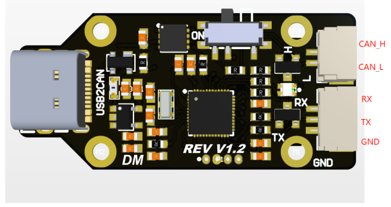

# Linux Driver for DMBot USB2CAN Device

CAN is widely used in robotics controlling. When controlling a robot with x86 PC, a USB2CAN device is essential.

DMBot USB2CAN is a small but powerfull board, but unluckily we did not found the related linux driver of it when we wrote this code. So we write a linux driver for it.

You can visit [DMBot's forum](http://www.dmbot.cn/forum.php?mod=viewthread&tid=328) for more details.

## Overview



DMBot USB2CAN use virtual serial port to forward CAN signal and UART signal. This project is a **Thirdparty Linux Driver** for DMBot USB2CAN device.

Here is a brief function view.

|        Function       | Realized or not |
| --------------------- | --------------- |
|  Send can data frame  |       Y         |
|     Send UART frame   |       Y         |
|  Recv can data frame  |       Y         |
|  Send can remote frame |      N         |
|   connection check    |       N         |
|   device reconnect    |       N         |
|  Send can failure handle |    N         |

## Develop Concept

The development of this project is based on following concepts.

1. Avoid runtime memory allocation.

    Runtime memory allocation may cause page fault in linux kernel, which is fatal for realtime controlling.

## Build & Run

This project only depends on basic c++ compile environment.

This project is constructed with CMakeLists.  You can build this project with cmake.

```bash
mkdir build
cd build
cmake ..
make -j3
```

### Run Demo
A simple can communication demo is provided in this project.

You can run the demo by the following commands.

```bash
cd build
./can_bus_demo
```

The demo will do two things:
1. listen to the can bus for 10 seconds. And echo the received can bags.

2. Send a can bag for 10 times.(1Hz)

## Get Started

1. Open a device.

    - To open a device, you are recommanded to config the settings of device first, which including the **MODE** of the device and the **CALLBACK FUNCTION** when received new data.

        * MODE: The device has two modes, which are ``usb to can`` mode and the ``usb to uart`` mode.
        * CALLBACK FUNCTION: When new can message is received, the can bus will use the callback function to call your program.


        You can use function ``enableCANMode`` or ``enableUARTMode`` to select the device mode. And use function``setCanDataFrameRecvCallBack`` and ``setCanBagRecvCallBack`` to set callback function.

        The difference between ``setCanBagRecvCallBack`` and ``setCanDataFrameRecvCallBack`` is that every time when a new can bag is received, ``setCanBagRecvCallBack`` function will be called, but function ``setCanDataFrameRecvCallBack`` will only be called when a can data frame is received.

        **ATTENTION**: the callback function should not block the program, otherwise the can bus receiving thread will be blocked.

    - After the configuration, you need to provide the hardwire id of the device to open it.

        You can used function ``listDevices`` to check the serial ports on your device, and use function ``openDeviceWithHID`` to open the device.

2. Send message.
    You can use function ``sendStandardCanMsg`` to send can message. Or use function ``write`` to send uart message.